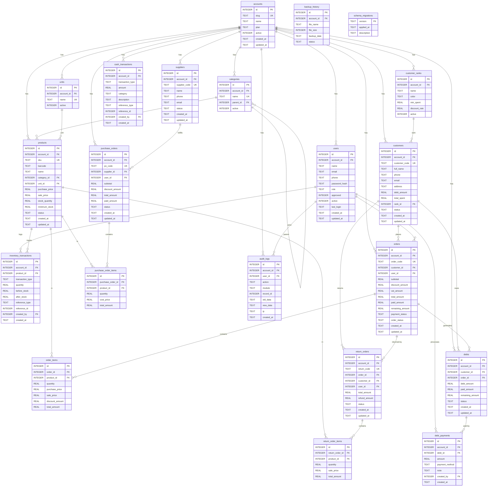

# ERD — Phan Mien Offline (SQLite Enterprise)
> Tự động sinh từ schema thực tế. Cập nhật: 2026-06-17

```mermaid
erDiagram
    accounts {
        INTEGER id PK
        TEXT slug UK
        TEXT name
        TEXT plan
        INTEGER active
        TEXT created_at
        TEXT updated_at
    }
    users {
        INTEGER id PK
        INTEGER account_id FK
        TEXT name
        TEXT email
        TEXT phone
        TEXT password_hash
        TEXT role
        INTEGER approved
        INTEGER active
        TEXT last_login
        TEXT created_at
        TEXT updated_at
    }
    customer_ranks {
        INTEGER id PK
        INTEGER account_id FK
        TEXT name
        TEXT color
        REAL min_spent
        REAL discount_rate
        INTEGER active
    }
    customers {
        INTEGER id PK
        INTEGER account_id FK
        TEXT customer_code UK
        TEXT full_name
        TEXT phone
        TEXT email
        TEXT address
        REAL debt_amount
        REAL total_spent
        INTEGER rank_id FK
        TEXT status
        TEXT created_at
        TEXT updated_at
    }
    categories {
        INTEGER id PK
        INTEGER account_id FK
        TEXT name UK
        INTEGER parent_id FK
        INTEGER active
    }
    units {
        INTEGER id PK
        INTEGER account_id FK
        TEXT name UK
        INTEGER active
    }
    products {
        INTEGER id PK
        INTEGER account_id FK
        TEXT sku UK
        TEXT barcode
        TEXT name
        INTEGER category_id FK
        INTEGER unit_id FK
        REAL purchase_price
        REAL sale_price
        REAL stock_quantity
        REAL minimum_stock
        TEXT status
        TEXT created_at
        TEXT updated_at
    }
    inventory_transactions {
        INTEGER id PK
        INTEGER account_id FK
        INTEGER product_id FK
        TEXT transaction_type
        REAL quantity
        REAL before_stock
        REAL after_stock
        TEXT reference_type
        INTEGER reference_id
        INTEGER created_by FK
        TEXT created_at
    }
    orders {
        INTEGER id PK
        INTEGER account_id FK
        TEXT order_code UK
        INTEGER customer_id FK
        INTEGER user_id FK
        REAL subtotal
        REAL discount_amount
        REAL vat_amount
        REAL total_amount
        REAL paid_amount
        REAL remaining_amount
        TEXT payment_status
        TEXT order_status
        TEXT created_at
        TEXT updated_at
    }
    order_items {
        INTEGER id PK
        INTEGER order_id FK
        INTEGER product_id FK
        REAL quantity
        REAL purchase_price
        REAL sale_price
        REAL discount_amount
        REAL total_amount
    }
    debts {
        INTEGER id PK
        INTEGER account_id FK
        INTEGER customer_id FK
        INTEGER order_id FK
        REAL debt_amount
        REAL paid_amount
        REAL remaining_amount
        TEXT status
        TEXT created_at
        TEXT updated_at
    }
    debt_payments {
        INTEGER id PK
        INTEGER account_id FK
        INTEGER debt_id FK
        REAL amount
        TEXT payment_method
        TEXT note
        INTEGER created_by FK
        TEXT created_at
    }
    cash_transactions {
        INTEGER id PK
        INTEGER account_id FK
        TEXT transaction_type
        REAL amount
        TEXT category
        TEXT description
        TEXT reference_type
        INTEGER reference_id
        INTEGER created_by FK
        TEXT created_at
    }
    suppliers {
        INTEGER id PK
        INTEGER account_id FK
        TEXT supplier_code UK
        TEXT name
        TEXT phone
        TEXT email
        TEXT status
        TEXT created_at
        TEXT updated_at
    }
    purchase_orders {
        INTEGER id PK
        INTEGER account_id FK
        TEXT po_code UK
        INTEGER supplier_id FK
        INTEGER user_id FK
        REAL subtotal
        REAL discount_amount
        REAL total_amount
        REAL paid_amount
        TEXT status
        TEXT created_at
        TEXT updated_at
    }
    purchase_order_items {
        INTEGER id PK
        INTEGER purchase_order_id FK
        INTEGER product_id FK
        REAL quantity
        REAL cost_price
        REAL total_amount
    }
    return_orders {
        INTEGER id PK
        INTEGER account_id FK
        TEXT return_code UK
        INTEGER order_id FK
        INTEGER customer_id FK
        INTEGER user_id FK
        REAL total_amount
        REAL refund_amount
        TEXT status
        TEXT created_at
        TEXT updated_at
    }
    return_order_items {
        INTEGER id PK
        INTEGER return_order_id FK
        INTEGER product_id FK
        REAL quantity
        REAL sale_price
        REAL total_amount
    }
    audit_logs {
        INTEGER id PK
        INTEGER account_id FK
        INTEGER user_id FK
        TEXT action
        TEXT module
        INTEGER record_id
        TEXT old_data
        TEXT new_data
        TEXT ip
        TEXT created_at
    }
    backup_history {
        INTEGER id PK
        INTEGER account_id FK
        TEXT file_name
        INTEGER file_size
        TEXT backup_date
        TEXT status
    }
    schema_migrations {
        TEXT version PK
        TEXT applied_at
        TEXT description
    }

    accounts ||--o{ users : "has"
    accounts ||--o{ customer_ranks : "has"
    accounts ||--o{ customers : "has"
    accounts ||--o{ categories : "has"
    accounts ||--o{ units : "has"
    accounts ||--o{ products : "has"
    accounts ||--o{ orders : "has"
    accounts ||--o{ debts : "has"
    accounts ||--o{ cash_transactions : "has"
    accounts ||--o{ suppliers : "has"
    accounts ||--o{ purchase_orders : "has"
    accounts ||--o{ audit_logs : "has"
    customer_ranks ||--o{ customers : "rank"
    categories ||--o{ products : "category"
    categories ||--o{ categories : "parent"
    units ||--o{ products : "unit"
    customers ||--o{ orders : "places"
    customers ||--o{ debts : "owes"
    customers ||--o{ return_orders : "returns"
    users ||--o{ orders : "creates"
    users ||--o{ inventory_transactions : "logs"
    users ||--o{ debt_payments : "processes"
    users ||--o{ audit_logs : "actor"
    products ||--o{ order_items : "in"
    products ||--o{ inventory_transactions : "tracks"
    products ||--o{ purchase_order_items : "in"
    products ||--o{ return_order_items : "in"
    orders ||--o{ order_items : "contains"
    orders ||--o{ debts : "generates"
    orders ||--o{ return_orders : "returned-by"
    debts ||--o{ debt_payments : "paid-by"
    suppliers ||--o{ purchase_orders : "fulfills"
    purchase_orders ||--o{ purchase_order_items : "contains"
    return_orders ||--o{ return_order_items : "contains"
```
