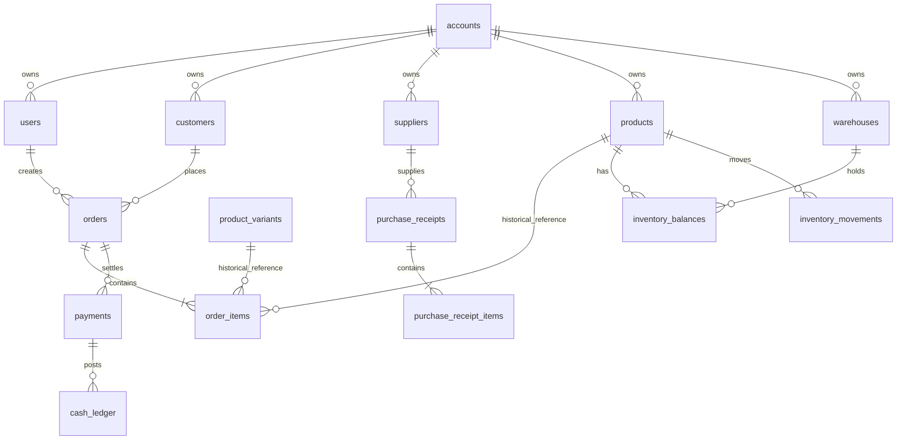

# Target Relational SQLite ERD

## Rules

- SQLite is the only writable business source after a successful cutover.
- Every account-scoped reference uses `FOREIGN KEY(account_id, child_id) REFERENCES parent(account_id,id)`.
- `ON DELETE RESTRICT` is the default for business documents and masters used by a document. `SET NULL` is used only for optional classification/reference data while document snapshots preserve historical text.
- `order_items.product_id` and `variant_id` are nullable, but SKU/name/unit snapshots are mandatory.
- Money is currently represented as SQLite numeric values; production rounding must be centralized before cutover. Prefer integer minor units in a later schema version if legacy precision requires it.

## Implemented Foundational ERD

## Implemented Tables

`accounts`, `stores`, `users`, `sessions`, `roles`, `permissions`, `role_permissions`, `user_roles`, `customer_types`, `customers`, `customer_addresses`, `suppliers`, `product_categories`, `units`, `products`, `product_variants`, `product_barcodes`, `combos`, `combo_items`, `warehouses`, `inventory_balances`, `orders`, `order_items`, `order_status_history`, `purchase_receipts`, `purchase_receipt_items`, `payments`, `customer_debts`, `supplier_debts`, `cash_accounts`, `bank_accounts`, `cash_ledger`, `inventory_movements`, `audit_logs`, `schema_migrations`, `migration_quarantine`.

The schema is implemented in `backend/src/db/relationalMigrations.js` and includes:

- `UNIQUE(account_id, sku_normalized)` for products and variants. Numeric, manual alphabetic, and `SP...` SKU values are accepted without forced prefixes.
- Case-insensitive unique order/receipt codes.
- Quantity, monetary, paid/remaining, and formula checks.
- Immutable trigger protection for `inventory_movements` and `cash_ledger`.
- A trigger blocking a completed order with no lines.
- A trigger blocking deletion of completed/cancelled orders.

## Required Next Schema Version

The foundational schema deliberately does not claim complete coverage of all legacy modules. Before cutover, add and migrate:

- `sales_returns`, `sales_return_items`, `purchase_returns`, `purchase_return_items`, including return-quantity checks.
- `inventory_batches`, `inventory_reservations`, `payment_allocations`, debt-payment tables, chart of accounts, accounting entries, report snapshots, e-invoice links.
- `payrolls`, `print_templates`, `marketplace_shops`, `marketplace_orders`, `excel_import_runs`, `excel_import_details`, `feature_catalog`, `system_settings`, `sync_metadata`, `update_releases`, `backup_files`, and `restore_jobs`.

No module is considered migrated merely because a similarly named legacy JSON collection exists.

## Delete Policy

| Relationship | Policy | Reason |
|---|---|---|
| Account -> business data | RESTRICT | Account is inactivated, never cascaded. |
| Customer/supplier/product -> posted document | RESTRICT or line FK SET NULL | Master is inactivated; historical snapshot remains readable. |
| Order -> order items | CASCADE only at physical draft deletion | Completed/cancelled document is blocked from delete. |
| Purchase receipt -> items | CASCADE only for draft path | Received receipt must be reversed, not deleted. |
| User -> sessions | CASCADE | Sessions are disposable if user has no retained business deletion path. |
| Ledger/audit rows | no cascade | These are immutable historical evidence. |
