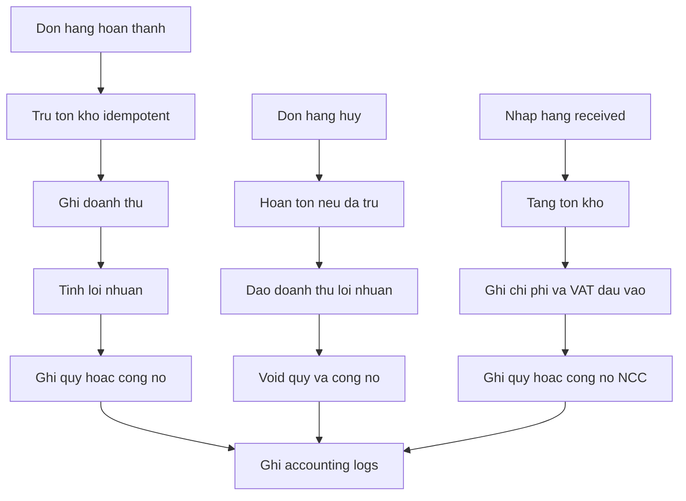

# Kế hoạch kiến trúc triển khai module 13-18 POS Offline

## Phạm vi rà soát

Tài liệu này ghi nhận hiện trạng đã xác minh trong workspace và kế hoạch triển khai kỹ thuật cho các module 13-18. Không triển khai production code trong subtask kiến trúc này.

Các vùng đã kiểm tra chính:

- Database JSON core tại [`backend/src/db/database.js`](backend/src/db/database.js:21).
- Mount route backend tại [`backend/src/server.js`](backend/src/server.js:233).
- Luồng đơn hàng tại [`backend/src/routes/invoices.js`](backend/src/routes/invoices.js:600) và service tạo đơn tại [`backend/src/services/invoiceCreationService.js`](backend/src/services/invoiceCreationService.js:392).
- Luồng nhập hàng tại [`backend/src/routes/imports.js`](backend/src/routes/imports.js:531).
- Báo cáo hiện có tại [`backend/src/routes/stats.js`](backend/src/routes/stats.js:398), [`backend/src/routes/inventory.js`](backend/src/routes/inventory.js:427).
- Sổ quỹ tại [`backend/src/routes/cashbook.js`](backend/src/routes/cashbook.js:18).
- Auth và phân quyền tại [`backend/src/middleware/auth.js`](backend/src/middleware/auth.js:217), [`backend/src/routes/users.js`](backend/src/routes/users.js:65).
- Router và menu frontend tại [`frontend/src/App.jsx`](frontend/src/App.jsx:117), [`frontend/src/App.jsx`](frontend/src/App.jsx:323), [`frontend/src/App.jsx`](frontend/src/App.jsx:438).
- Các page liên quan: [`frontend/src/pages/Stats.jsx`](frontend/src/pages/Stats.jsx:21), [`frontend/src/pages/ProductReport.jsx`](frontend/src/pages/ProductReport.jsx:667), [`frontend/src/pages/KhoHang.jsx`](frontend/src/pages/KhoHang.jsx:23), [`frontend/src/pages/CashBook.jsx`](frontend/src/pages/CashBook.jsx:32), [`frontend/src/pages/nhaphang.jsx`](frontend/src/pages/nhaphang.jsx:648).

## Hiện trạng phát hiện

### Database và migration hiện tại

- Core database là JSON file đồng bộ, khai báo bảng bằng object [`SCHEMA`](backend/src/db/database.js:21), lưu bằng atomic rename tại [`saveDB()`](backend/src/db/database.js:912) và transaction in-process qua [`withAtomicDbWrite()`](backend/src/db/database.js:924).
- Các bảng hiện có gồm `accounts`, `sessions`, `permissions`, `role_permissions`, `sync_metadata`, `audit_logs`, `system_settings`, `store_info`, `users`, `customers`, `products`, `product_categories`, `partners`, `invoices`, `invoice_details`, `import_logs`, `import_details`, `daily_stats`, `cash_book`, v.v. tại [`SCHEMA`](backend/src/db/database.js:21).
- Các bảng theo yêu cầu module 18 chưa có đúng tên: `accounting_transactions`, `cash_fund`, `bank_accounts`, `customer_debts`, `supplier_debts`, `einvoice_in`, `einvoice_out`, `tax_reports`, `revenue_reports`, `profit_reports`, `accounting_logs`.
- Có bảng gần tương đương nhưng chưa đủ yêu cầu: `cash_book` thay cho `cash_fund`, `audit_logs` thay cho `accounting_logs`, `daily_stats` thay một phần `revenue_reports`.
- Migration hiện có chạy trong [`migrateDB()`](backend/src/db/database.js:861), tự tạo bảng thiếu, seed permission, sync metadata, daily stats.
- Backup hiện chỉ có [`backupDB()`](backend/src/db/database.js:483) khi DB corrupt và backup trước update ở Electron [`backupDatabase()`](src/updater.js:592), chưa có backup tự động định kỳ trong backend runtime.

### Báo cáo thuế GTGT hiện tại

- Có endpoint [`GET /api/stats/tax-report`](backend/src/routes/stats.js:403), nhưng chỉ tính tổng `subtotal`, `vat_amount`, `profit` từ hóa đơn bán hoàn thành.
- Chưa tổng hợp thuế đầu vào từ hóa đơn điện tử đầu vào hoặc từ bảng `einvoice_in` vì bảng chưa tồn tại.
- Chưa có bảng `tax_reports` để lưu snapshot báo cáo theo kỳ.
- Nhập hàng đã có dữ liệu thuế ở dòng nhập `tax_percent`, `tax_amount`, `vat_percent`, `vat_amount`, `taxable_amount` tại [`detailPayload()`](backend/src/routes/imports.js:84), có thể dùng làm fallback cho VAT đầu vào nếu chưa có e-invoice.

### Báo cáo tồn kho hiện tại

- Có page kho [`frontend/src/pages/KhoHang.jsx`](frontend/src/pages/KhoHang.jsx:367) hiển thị sản phẩm, tồn, giá nhập, giá bán và trạng thái sắp hết, hết hàng, âm kho.
- Có endpoint [`GET /api/inventory/negative-stock`](backend/src/routes/inventory.js:427) chỉ phục vụ danh sách âm kho có pagination/filter.
- Chưa có endpoint báo cáo tồn kho tổng hợp đúng yêu cầu gồm mã sản phẩm, tên, tồn kho, giá vốn, giá trị tồn kho, cảnh báo sắp hết, hết hàng, âm kho.
- Ngưỡng sắp hết hàng đang hard-code `stock < 5` trong UI tại [`getInventoryStatusKey()`](frontend/src/pages/KhoHang.jsx:247), cần chuẩn hóa thành cấu hình hoặc query parameter.

### Kết nối POS với kế toán/kho/quỹ/công nợ hiện tại

- Tạo đơn qua [`POST /api/invoices`](backend/src/routes/invoices.js:600) gọi [`createInvoiceFromPayload()`](backend/src/services/invoiceCreationService.js:392).
- Tạo đơn hiện trừ tồn kho ngay khi tạo chi tiết, bất kể trạng thái đơn, tại [`createInvoiceFromPayload()`](backend/src/services/invoiceCreationService.js:455). Yêu cầu mới ghi rõ trừ tồn khi đơn hoàn thành, nên đây là điểm lệch nghiệp vụ quan trọng.
- Khi đơn hoàn thành hoặc cập nhật trạng thái, [`syncInvoiceAccounting()`](backend/src/services/invoiceCreationService.js:366) ghi `cash_book` nếu completed và rebuild `daily_stats`, nhưng chưa ghi `accounting_transactions`, `revenue_reports`, `profit_reports`, `customer_debts`.
- Khi hủy đơn, route [`DELETE /api/invoices/:id`](backend/src/routes/invoices.js:711) hoàn tồn kho và void sổ quỹ bằng [`syncInvoiceAccounting()`](backend/src/services/invoiceCreationService.js:366), nhưng chưa đảo bút toán kế toán, lợi nhuận, công nợ.
- Nhập hàng [`POST /api/imports`](backend/src/routes/imports.js:531) có thể tăng tồn kho qua [`applyStockForImport()`](backend/src/routes/imports.js:245), ghi chi phí vào `cash_book` khi thanh toán qua [`upsertImportPaymentCashBook()`](backend/src/routes/imports.js:372), nhưng chưa ghi `accounting_transactions`, `supplier_debts`, `cash_fund`.

### Nhật ký hoạt động hiện tại

- Có helper [`auditLog()`](backend/src/db/database.js:1197) ghi `audit_logs`.
- Log hiện mới được gọi cho auth, update release, feature, settings, negative stock một phần; chưa ghi toàn bộ thao tác tạo/sửa/hủy đơn, nhập hàng, xuất hàng, thu chi, xóa dữ liệu theo yêu cầu module 16.
- Chưa có API/page để xem nhật ký hoạt động.

### Phân quyền hiện tại

- Middleware auth đã có [`requireAuth`](backend/src/middleware/auth.js:217), [`requirePermission()`](backend/src/middleware/auth.js:265), [`requireAnyPermission()`](backend/src/middleware/auth.js:275).
- Permission keys hiện seed trong [`DEFAULT_PERMISSIONS`](backend/src/db/database.js:67) và route frontend map trong [`ROUTE_PERMISSIONS`](frontend/src/App.jsx:117).
- User route hiện chỉ normalize role thành `admin` hoặc `user` tại [`normalizeRole()`](backend/src/routes/users.js:65), chưa có `accountant`, `cashier`, `employee` đúng yêu cầu.
- UI Settings hiện chỉ hiển thị role Admin/Nhân viên tại [`frontend/src/pages/Settings.jsx`](frontend/src/pages/Settings.jsx:1525).

### Offline-first và sync hiện tại

- Sync metadata theo bảng được khai báo trong [`SYNC_TRACKED_TABLES`](backend/src/db/database.js:112).
- Sync pull hiện chỉ đưa một số bảng trong [`PULL_TABLES`](backend/src/routes/sync.js:13), chưa có các bảng kế toán/e-invoice/report/log mới.
- Frontend có polling sync trong [`frontend/src/App.jsx`](frontend/src/App.jsx:637), cần đưa bảng mới vào phiên bản sync hoặc chủ động chỉ sync dữ liệu cần thiết.

## Mô hình dữ liệu đề xuất

### Bảng mới cần thêm vào `SCHEMA`

Thêm các bảng bắt buộc trong [`SCHEMA`](backend/src/db/database.js:21), [`ACCOUNT_SCOPED_TABLES`](backend/src/db/database.js:59), [`SYNC_TRACKED_TABLES`](backend/src/db/database.js:112):

| Bảng | Mục đích | Khóa quan hệ chính | Chỉ mục logic cần có |
|---|---|---|---|
| `accounting_transactions` | Ledger bút toán kế toán doanh thu, giá vốn, thuế, quỹ, công nợ | `account_id`, `source_type`, `source_id`, `source_action`, `customer_id`, `partner_id` | `account_id+transaction_date`, `source_type+source_id+source_action`, `account_code`, `idempotency_key` |
| `cash_fund` | Sổ quỹ chuẩn mới, thay hoặc mirror `cash_book` | `account_id`, `cash_book_id`, `bank_account_id`, `source_type`, `source_id` | `account_id+date`, `fund_type`, `source_type+source_id`, `active` |
| `bank_accounts` | Danh mục tài khoản ngân hàng | `account_id` | `account_id+bank_account_number`, `active` |
| `customer_debts` | Công nợ khách hàng theo chứng từ | `customer_id`, `invoice_id`, `settlement_cash_fund_id` | `account_id+customer_id`, `status`, `due_date`, `invoice_id` |
| `supplier_debts` | Công nợ nhà cung cấp theo phiếu nhập | `partner_id`, `import_id`, `settlement_cash_fund_id` | `account_id+partner_id`, `status`, `due_date`, `import_id` |
| `einvoice_in` | Hóa đơn điện tử đầu vào | `partner_id`, `import_id` | `account_id+invoice_date`, `supplier_tax_code+invoice_no+symbol`, `status` |
| `einvoice_out` | Hóa đơn điện tử đầu ra | `customer_id`, `invoice_id` | `account_id+invoice_date`, `buyer_tax_code+invoice_no+symbol`, `status` |
| `tax_reports` | Snapshot báo cáo GTGT theo kỳ | `account_id` | `account_id+period_from+period_to`, `status` |
| `revenue_reports` | Snapshot báo cáo doanh thu theo kỳ | `account_id` | `account_id+period_from+period_to`, `status` |
| `profit_reports` | Snapshot báo cáo lợi nhuận theo kỳ | `account_id` | `account_id+period_from+period_to`, `status` |
| `accounting_logs` | Nhật ký hoạt động nghiệp vụ | `user_id`, `entity_type`, `entity_id` | `account_id+created_at`, `action`, `user_id`, `entity_type+entity_id` |

### Trường quan trọng cho từng nhóm bảng

- Bảng ledger `accounting_transactions`: `id`, `account_id`, `transaction_date`, `posted_at`, `source_type`, `source_id`, `source_code`, `source_action`, `direction`, `account_code`, `account_name`, `debit_amount`, `credit_amount`, `amount`, `currency`, `description`, `customer_id`, `partner_id`, `tax_report_id`, `revenue_report_id`, `profit_report_id`, `idempotency_key`, `reversal_of_id`, `status`, `created_by`, `created_at`, `updated_at`.
- Bảng `cash_fund`: `id`, `account_id`, `date`, `time`, `fund_type` gồm `cash` hoặc `bank`, `bank_account_id`, `type` gồm `income` hoặc `expense`, `category`, `amount`, `payment_method`, `note`, `source_type`, `source_id`, `cash_book_id`, `active`, `voided_at`, `void_reason`, `created_by`, `created_at`, `updated_at`.
- Bảng công nợ: `id`, `account_id`, `customer_id` hoặc `partner_id`, `invoice_id` hoặc `import_id`, `debt_date`, `source_code`, `opening_amount`, `increase_amount`, `decrease_amount`, `remaining_amount`, `status`, `due_date`, `note`, `created_at`, `updated_at`.
- Bảng e-invoice: `id`, `account_id`, `invoice_no`, `symbol`, `template_code`, `invoice_date`, `supplier_tax_code` hoặc `buyer_tax_code`, `supplier_name` hoặc `buyer_name`, `subtotal`, `vat_rate`, `vat_amount`, `total`, `xml_hash`, `raw_xml`, `source_type`, `source_id`, `status`, `created_at`, `updated_at`.
- Bảng report snapshot: `id`, `account_id`, `period_from`, `period_to`, `generated_at`, `generated_by`, `status`, `summary`, `detail_rows`, `source_hash`, `created_at`, `updated_at`.
- Bảng `accounting_logs`: `id`, `account_id`, `user_id`, `user_name`, `action`, `entity_type`, `entity_id`, `entity_code`, `content`, `before`, `after`, `ip`, `user_agent`, `created_at`.

### Migration/init phù hợp codebase

1. Cập nhật [`SCHEMA`](backend/src/db/database.js:21), [`INITIAL_NEXT_ID`](backend/src/db/database.js:54) tự sinh theo `SCHEMA`.
2. Thêm bảng mới vào [`ACCOUNT_SCOPED_TABLES`](backend/src/db/database.js:59) để tự gán `account_id`.
3. Thêm các bảng cần đồng bộ vào [`SYNC_TRACKED_TABLES`](backend/src/db/database.js:112). Với `accounting_logs` nên cân nhắc chỉ sync metadata hoặc giới hạn pull theo trang để tránh nặng.
4. Thêm migration idempotent trong [`migrateDB()`](backend/src/db/database.js:861):
   - Đảm bảo các mảng mới tồn tại.
   - Backfill `account_id`, `created_at`, `updated_at`.
   - Seed permission mới.
   - Seed role permissions cho `admin`, `accountant`, `cashier`, `employee`.
   - Backfill `cash_fund` từ `cash_book` với `source_type`, `source_id`, `cash_book_id`.
   - Backfill `revenue_reports` hoặc ledger từ hóa đơn hoàn thành theo chế độ an toàn, không làm thay đổi tồn kho.
   - Ghi schema version vào `system_settings` key `accounting_schema_version`.
5. Trước migration lớn, gọi backup an toàn tương tự [`backupDB()`](backend/src/db/database.js:483) nhưng export public function hoặc tạo `createDbBackup(reason)`.

## API backend cần tạo hoặc sửa

### Nhóm service nền tảng

- Tạo service `backend/src/services/accountingService.js` để chứa bút toán idempotent:
  - `postInvoiceCompleted(invoice, details, options)`.
  - `reverseInvoice(invoice, reason, options)`.
  - `postImportReceived(importLog, details, options)`.
  - `postImportPayment(importLog, payment, options)`.
  - `reverseImport(importLog, reason, options)`.
  - `upsertCashFundFromSource(source, options)`.
  - `upsertCustomerDebtFromInvoice(invoice, options)`.
  - `upsertSupplierDebtFromImport(importLog, options)`.
- Tạo helper `backend/src/services/accountingLogService.js`:
  - `logActivity(req, action, entity, before, after, content, options)`.
  - `logDataDeletion(req, entity, before)`.
  - Ghi vào `accounting_logs`, đồng thời có thể gọi `auditLog()` để tương thích.

### Báo cáo thuế GTGT module 13

- Tạo route mới `backend/src/routes/accountingReports.js` hoặc mở rộng [`backend/src/routes/stats.js`](backend/src/routes/stats.js:403) nhưng khuyến nghị route riêng `/api/accounting`.
- Endpoint đề xuất:
  - `GET /api/accounting/tax-report?from=YYYY-MM-DD&to=YYYY-MM-DD&source=auto|einvoice|fallback` trả `total_input_vat`, `total_output_vat`, `vat_payable`, `input_sources`, `output_sources`.
  - `POST /api/accounting/tax-reports/generate` lưu snapshot vào `tax_reports`.
  - `GET /api/accounting/tax-reports` danh sách snapshot có pagination.
  - `GET /api/accounting/tax-reports/:id` chi tiết snapshot.
  - `GET /api/accounting/einvoice-in`, `POST /api/accounting/einvoice-in`, `PUT /api/accounting/einvoice-in/:id`, `DELETE /api/accounting/einvoice-in/:id`.
  - `GET /api/accounting/einvoice-out`, `POST /api/accounting/einvoice-out`, `PUT /api/accounting/einvoice-out/:id`, `DELETE /api/accounting/einvoice-out/:id`.
- Logic nguồn dữ liệu:
  - Thuế đầu vào ưu tiên `einvoice_in`; fallback từ `import_details` có `vat_amount` khi chưa có e-invoice liên kết.
  - Thuế đầu ra ưu tiên `einvoice_out`; fallback từ `invoices.vat_amount` khi chưa có e-invoice liên kết.
  - Chống double count bằng `source_type`, `source_id`, `invoice_no`, `xml_hash`.

### Báo cáo tồn kho module 14

- Tạo endpoint `GET /api/inventory/report` trong [`backend/src/routes/inventory.js`](backend/src/routes/inventory.js:427) hoặc route riêng `inventoryReports.js`.
- Query: `search`, `category_id`, `warehouse_id`, `status=all|low|out|negative|in_stock`, `page`, `limit`, `sort`, `order`, `low_stock_threshold`.
- Response gồm:
  - `items`: `product_code`, `sku`, `product_name`, `stock`, `cost_price`, `inventory_value`, `status`, `warning_level`, `category`, `warehouse`.
  - `summary`: `total_items`, `total_stock`, `total_inventory_value`, `low_stock_count`, `out_of_stock_count`, `negative_stock_count`.
  - `pagination`, `filters`, `generated_at`.
- Sử dụng `products.import_price` làm giá vốn fallback, với biến thể ưu tiên giá của biến thể; sản phẩm cha có biến thể thì có thể không tính stock riêng hoặc roll-up theo option `rollup=1`.

### Kết nối POS module 15

- Sửa [`createInvoiceFromPayload()`](backend/src/services/invoiceCreationService.js:392), [`PATCH /api/invoices/:id/confirm`](backend/src/routes/invoices.js:766), [`DELETE /api/invoices/:id`](backend/src/routes/invoices.js:711):
  - Thêm trạng thái hiệu ứng kho/kế toán: `stock_effect_status`, `accounting_status`, `posted_at`, `reversed_at`.
  - Bảo đảm event idempotent bằng `idempotency_key` theo `invoice:id:action`.
  - Với yêu cầu mới, trừ tồn khi đơn chuyển sang completed. Do code hiện trừ khi tạo đơn, cần migration/backfill đánh dấu các đơn hiện có đã tác động kho để tránh trừ lần hai.
  - Khi hoàn thành: ghi `accounting_transactions`, `cash_fund`, `revenue_reports` hoặc summary, `profit_reports`, `customer_debts` nếu còn nợ.
  - Khi hủy: hoàn tồn nếu đã trừ, void `cash_fund`, đảo bút toán bằng `reversal_of_id`, cập nhật debt còn lại về 0 hoặc reversed.
- Sửa [`POST /api/imports`](backend/src/routes/imports.js:531), [`PUT /api/imports/:idOrCode`](backend/src/routes/imports.js:608), [`POST /api/imports/:idOrCode/cancel`](backend/src/routes/imports.js:720), [`PATCH /api/imports/:idOrCode/payment`](backend/src/routes/imports.js:779):
  - Khi nhập received: tăng tồn kho, ghi chi phí nhập hàng, ghi VAT đầu vào nếu có, tạo/cập nhật supplier debt nếu chưa thanh toán.
  - Khi thanh toán: ghi `cash_fund` expense, giảm supplier debt, ghi bút toán tiền/quỹ.
  - Khi hủy/xóa: rollback tồn, đảo bút toán và công nợ.

### Nhật ký hoạt động module 16

- Thêm middleware/helper gọi tại các route ghi dữ liệu:
  - Đơn hàng: tạo, sửa, hủy, xác nhận.
  - Nhập hàng: tạo, sửa, hủy, xóa, thanh toán.
  - Xuất hàng hoặc trả hàng: route [`backend/src/routes/returns.js`](backend/src/routes/returns.js:35) nếu được coi là xuất/hoàn.
  - Thu chi: tạo, sửa, xóa trong [`backend/src/routes/cashbook.js`](backend/src/routes/cashbook.js:65).
  - Xóa dữ liệu: bulk delete customers/products/imports/invoices nếu có.
- API:
  - `GET /api/accounting/logs?from&to&action&entity_type&user_id&page&limit`.
  - `GET /api/accounting/logs/:id`.
- Log phải lưu `user_id`, `user_name`, `created_at`, `content`, `before`, `after`, `entity_type`, `entity_id`.

### Phân quyền module 17

- Cập nhật [`DEFAULT_PERMISSIONS`](backend/src/db/database.js:67):
  - `accounting.read`, `accounting.manage`.
  - `tax_reports.read`, `tax_reports.manage`.
  - `inventory_reports.read`.
  - `revenue_reports.read`, `profit_reports.read`.
  - `debts.read`, `debts.manage`.
  - `einvoices.read`, `einvoices.manage`.
  - `bank_accounts.read`, `bank_accounts.manage`.
  - `activity_logs.read`.
- Cập nhật role:
  - `admin`: toàn quyền.
  - `accountant`: toàn quyền kế toán, thuế, doanh thu, lợi nhuận, công nợ, quỹ, e-invoice, logs nghiệp vụ; không nhất thiết quản trị user/update.
  - `cashier`: chỉ xem doanh thu, ví dụ `revenue_reports.read` và phần thống kê doanh thu read-only.
  - `employee`: không có quyền kế toán.
- Sửa [`normalizeRole()`](backend/src/routes/users.js:65) để chấp nhận `accountant`, `cashier`, `employee`.
- Sửa [`ROUTE_PERMISSIONS`](frontend/src/App.jsx:117) và menu để page kế toán chỉ hiện đúng role.

### Database module 18

- Tạo đủ bảng JSON trong `SCHEMA` trước, giữ tương thích với codebase hiện tại.
- Tối ưu dữ liệu lớn ở mức JSON:
  - Thêm pagination bắt buộc cho report/log/einvoice/debt.
  - Dùng map index in-memory theo `id`, `source`, `date` trong service report thay vì nested loop toàn bộ khi có thể.
  - Lưu snapshot `tax_reports`, `revenue_reports`, `profit_reports` để không tính lại toàn bộ khi xem kỳ cũ.
  - Thêm query param `limit` mặc định an toàn cho logs và reports.
  - Giảm payload sync, không pull toàn bộ `accounting_logs` mặc định.
- Backup tự động:
  - Thêm service `backupService` chạy cron trong [`backend/src/server.js`](backend/src/server.js:311), ví dụ lịch hàng ngày và trước migration lớn.
  - Lưu vào `backend/data/backups` hoặc thư mục cạnh [`DB_PATH`](backend/src/db/database.js:17), đặt retention theo số lượng file và dung lượng.
  - Ghi log backup vào `accounting_logs` hoặc `audit_logs`.

## UI/frontend cần tạo hoặc sửa

### Menu và routing

- Sửa [`frontend/src/App.jsx`](frontend/src/App.jsx:117): thêm routes quyền:
  - `/bao-cao-thue-gtgt`: `tax_reports.read`.
  - `/bao-cao-ton-kho`: `inventory_reports.read`.
  - `/ke-toan`: `accounting.read`.
  - `/nhat-ky-hoat-dong`: `activity_logs.read`.
  - `/cong-no`: `debts.read`.
- Sửa nav group quản lý tại [`frontend/src/App.jsx`](frontend/src/App.jsx:323) hoặc tạo group `Kế toán` riêng để tránh trộn với danh mục.
- Thêm routes tại [`frontend/src/App.jsx`](frontend/src/App.jsx:438).

### Page mới hoặc chỉnh sửa

- Tạo `frontend/src/pages/TaxReport.jsx`:
  - Bộ lọc kỳ ngày/tháng/năm.
  - Card tổng thuế đầu vào, thuế đầu ra, thuế phải nộp.
  - Bảng nguồn đầu vào/đầu ra, trạng thái e-invoice/fallback, xuất Excel.
  - Nút tạo snapshot nếu có `tax_reports.manage`.
- Tạo `frontend/src/pages/InventoryReport.jsx` hoặc mở rộng [`frontend/src/pages/KhoHang.jsx`](frontend/src/pages/KhoHang.jsx:367):
  - Bảng mã sản phẩm, tên sản phẩm, tồn kho, giá vốn, giá trị tồn kho.
  - Filter cảnh báo low/out/negative.
  - Summary tổng giá trị tồn kho.
  - Xuất Excel.
- Tạo `frontend/src/pages/AccountingDashboard.jsx`:
  - Tổng quan doanh thu, lợi nhuận, quỹ, công nợ.
  - Link tới báo cáo thuế, tồn kho, công nợ, sổ quỹ.
- Tạo `frontend/src/pages/ActivityLogs.jsx`:
  - Filter thao tác, người thực hiện, thời gian, entity.
  - Bảng nội dung, user, time, chi tiết before/after.
- Chỉnh [`frontend/src/pages/Settings.jsx`](frontend/src/pages/Settings.jsx:478):
  - Thêm role selector `Admin`, `Kế toán`, `Thu ngân`, `Nhân viên`.
  - Hiển thị mô tả quyền theo role.
- Chỉnh [`frontend/src/pages/CashBook.jsx`](frontend/src/pages/CashBook.jsx:32):
  - Hiển thị nguồn tự động từ đơn/phiếu nhập.
  - Phân biệt record manual và generated.
  - Nếu dùng `cash_fund`, đọc từ endpoint mới hoặc adapter đồng bộ với `cash_book`.

## Luồng nghiệp vụ mục tiêu

## Kế hoạch triển khai theo thứ tự

1. Chuẩn hóa schema và migration an toàn trong [`backend/src/db/database.js`](backend/src/db/database.js:21): thêm bảng mới, bảng scoped, sync tracked, seed permission, seed role, schema version, backup trước migration.
2. Tạo service kế toán idempotent `accountingService` và service log hoạt động; chưa gắn UI ở bước này.
3. Tích hợp service kế toán vào luồng đơn hàng [`backend/src/services/invoiceCreationService.js`](backend/src/services/invoiceCreationService.js:366) và [`backend/src/routes/invoices.js`](backend/src/routes/invoices.js:711): completed, cancel, edit; bảo vệ không double trừ tồn/doanh thu.
4. Tích hợp service kế toán vào luồng nhập hàng [`backend/src/routes/imports.js`](backend/src/routes/imports.js:531): received, update, cancel, payment, delete.
5. Xây API báo cáo thuế/e-invoice/tax snapshot dưới `/api/accounting` và mount trong [`backend/src/server.js`](backend/src/server.js:233).
6. Xây API báo cáo tồn kho tổng hợp trong [`backend/src/routes/inventory.js`](backend/src/routes/inventory.js:427) hoặc route mới; đảm bảo pagination/filter/export data.
7. Xây API công nợ, quỹ, bank accounts, activity logs với permission cụ thể.
8. Cập nhật sync/offline trong [`backend/src/routes/sync.js`](backend/src/routes/sync.js:13) và [`backend/src/db/database.js`](backend/src/db/database.js:112): chỉ sync bảng cần thiết, logs/report dùng pagination.
9. Cập nhật frontend API helpers trong [`frontend/src/utils/apiClient.js`](frontend/src/utils/apiClient.js:642) cho `accountingApi`, `taxReportsApi`, `inventoryReportsApi`, `activityLogsApi`.
10. Cập nhật frontend route/menu/permission trong [`frontend/src/App.jsx`](frontend/src/App.jsx:117) và thêm các page mới.
11. Cập nhật Settings quản lý role trong [`frontend/src/pages/Settings.jsx`](frontend/src/pages/Settings.jsx:478).
12. Kiểm thử smoke theo luồng: tạo đơn pending, hoàn thành, hủy, nhập received, thanh toán nhập, báo cáo thuế, báo cáo tồn kho, log hoạt động, role access.

## Rủi ro tương thích và khuyến nghị

- Rủi ro lệch nghiệp vụ tồn kho: hiện tại tạo đơn đã trừ tồn tại [`createInvoiceFromPayload()`](backend/src/services/invoiceCreationService.js:455), trong khi yêu cầu mới là trừ khi đơn hoàn thành. Cần migration trạng thái `stock_effect_status` để không trừ/hoàn hai lần.
- Rủi ro mất dấu vết kế toán: server đang xóa đơn hủy quá 24 giờ qua [`deleteExpiredCancelledInvoices()`](backend/src/db/database.js:1112) và cron [`server.js`](backend/src/server.js:334). Nên chuyển sang lưu lịch sử hoặc snapshot accounting trước khi xóa, tốt nhất không hard-delete chứng từ kế toán.
- Rủi ro dữ liệu lớn: JSON DB ghi toàn file ở [`saveDB()`](backend/src/db/database.js:912), nên report/log/e-invoice phải pagination và snapshot; cân nhắc SQLite adapter trong giai đoạn sau nếu dữ liệu tăng mạnh.
- Rủi ro double count thuế: nếu vừa có e-invoice vừa có invoice/import fallback, cần khóa tự nhiên `invoice_no+symbol+tax_code` và `source_type+source_id`.
- Rủi ro phân quyền cũ: user hiện chỉ `admin/user`; khi thêm role mới phải migrate user cũ an toàn, `user` cũ nên map thành `employee` hoặc giữ alias `user` không có kế toán.
- Rủi ro offline sync: không nên sync toàn bộ `accounting_logs` và report detail lớn mặc định; chỉ sync versions và page khi user mở màn hình.
- Rủi ro profit sai: `invoice_details.import_price` là snapshot lúc bán, nhưng combo hoặc sản phẩm thiếu giá vốn có thể làm lợi nhuận lệch; cần quy tắc fallback rõ ràng và hiển thị cảnh báo dòng thiếu cost.
