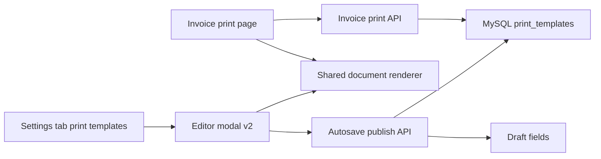

# Kiến trúc nâng cấp module quản lý mẫu in hóa đơn

## 1. Phạm vi subtask

Subtask này chỉ làm 3 việc:
- khảo sát hiện trạng frontend và backend liên quan tới mẫu in hóa đơn
- đối chiếu với yêu cầu editor kiểu Canva production-ready
- chốt kiến trúc triển khai và danh sách file cần sửa hoặc tạo

Không triển khai code tính năng ngoài việc cập nhật tài liệu kiến trúc.

## 2. File đã khảo sát

### Backend
- `backend/src/routes/printTemplates.js`
- `backend/src/services/printTemplateService.js`
- `backend/src/db/printTemplatesMySql.js`
- `backend/src/db/printTemplatesSchema.js`
- `backend/src/middleware/printTemplateUpload.js`
- `backend/src/routes/invoices.js`
- `backend/src/server.js`
- `backend/src/db/database.js`
- `backend/scripts/init-print-templates-mysql.js`
- `backend/package.json`

### Frontend
- `frontend/src/pages/InvoicePrint.jsx`
- `frontend/src/pages/Settings.jsx`
- `frontend/src/components/invoice-print/InvoiceTemplateRenderer.jsx`
- `frontend/src/components/invoice-print/PrintTemplateFormModal.jsx`
- `frontend/src/components/invoice-print/templateDefaults.js`
- `frontend/src/components/invoice-print/mockInvoicePayload.js`
- `frontend/src/utils/apiClient.js`
- `frontend/src/index.css`
- `frontend/package.json`

### Tài liệu
- `plans/quan-ly-mau-in-hoa-don-architecture.md`

## 3. Hiện trạng đã xác nhận

### 3.1 Backend hiện có

Module mẫu in hóa đơn không còn là ý tưởng nữa, mà đã có một nền tảng chạy thật:

1. Đã có route CRUD riêng tại `/api/print-templates`
   - list
   - detail
   - default
   - create
   - update
   - soft delete
   - set default
   - upload logo
   - remove logo

2. Đã có lớp service riêng cho module mẫu in
   - parse payload
   - validate cơ bản
   - serialize dữ liệu trả ra frontend
   - xử lý default template theo transaction lock
   - xử lý logo path đang dùng và cleanup file cũ

3. Đã có MySQL pool độc lập cho module print templates
   - module còn lại của backend vẫn dùng JSON DB
   - module mẫu in dùng MySQL riêng
   - đây là kiến trúc mixed storage đã chạy được

4. Đã có bootstrap schema và script init riêng
   - backend start có `ensurePrintTemplatesSchema`
   - có script `init-print-templates-mysql`

5. Đã có upload logo và static serving
   - thư mục `backend/data/uploads/print-templates`
   - public path `/static/print-templates`
   - kiểm soát mime và dung lượng file bằng `multer`

6. Đã tích hợp template vào luồng in hóa đơn thật
   - endpoint `/api/invoices/:idOrCode/print` đã attach template vào payload
   - nếu MySQL template lỗi thì backend fallback về luồng in hiện tại để không chặn bán hàng

7. Đã có permission riêng
   - `print_templates.read`
   - `print_templates.manage`

### 3.2 Frontend hiện có

Frontend cũng đã có nền tảng dùng được thật:

1. Đã có tab quản lý mẫu in trong `Settings`
   - tải danh sách template từ API thật
   - tạo, sửa, xóa, đặt mặc định
   - upload và xóa logo

2. Đã có modal cấu hình mẫu in và preview realtime
   - hiện là editor kiểu form cấu hình
   - thay đổi font size, scale, padding, table width, toggle logo, QR, chữ ký, ghi chú, công nợ
   - preview realtime bằng `mockInvoicePayload`

3. Đã có renderer dùng chung cho preview và trang in
   - `InvoiceTemplateRenderer` đã render từ `template + payload`
   - `InvoicePrint` chỉ làm vai trò container fetch dữ liệu và print hoặc PDF

4. Đã có CSS A5 tương đối hoàn chỉnh
   - dùng đơn vị `mm`
   - có `@page`
   - có `display: table-header-group`
   - có `break-inside: avoid`
   - có style riêng cho preview và print

5. Đã có API client riêng cho print templates
   - CRUD
   - set default
   - upload logo bằng `FormData`

### 3.3 Mô hình dữ liệu hiện tại

Bảng `print_templates` hiện đã có các cột chính:
- `layout_json`
- `settings_json`
- `paper_size`
- `orientation`
- `status`
- `is_default`
- `logo_url`
- `logo_path`
- `shop_name`
- `shop_address`
- `shop_phone`

Tuy nhiên dữ liệu hiện tại vẫn là schema v1, thiên về cấu hình tham số hơn là layout editor kiểu Canva.

### 3.4 Ràng buộc kỹ thuật hiện tại

1. `InvoiceTemplateRenderer` đang là renderer semantic cố định
   - header
   - info
   - items table
   - totals
   - note
   - signatures
   - footer

2. `layout_json` hiện chưa mô tả được các block tự do có tọa độ, kích thước, layer và binding

3. Modal hiện tại là form-based editor, chưa phải stage editor kéo thả hoặc resize

## 4. Đối chiếu với yêu cầu người dùng

| Yêu cầu | Hiện trạng | Đánh giá |
|---|---|---|
| CRUD template | Đã có | Đạt |
| Upload logo | Đã có | Đạt |
| Lưu JSON vào MySQL | Đã có nhưng schema còn v1 | Đạt một phần |
| Preview realtime | Đã có dạng form preview | Đạt một phần |
| In chuẩn A5 | Đã có nền tảng tốt | Đạt một phần |
| Editor kiểu Canva | Chưa có | Thiếu |
| Drag và drop | Chưa có | Thiếu |
| Resize block | Chưa có | Thiếu |
| Autosave | Chưa có | Thiếu |
| Draft và publish an toàn | Chưa có | Thiếu |
| Soft migration template cũ | Chưa có | Thiếu |
| Production-ready cho layout editor | Chưa có | Thiếu |

## 5. Kết luận hiện trạng

Codebase hiện tại đã đi được khoảng nửa đường:
- phần backend CRUD MySQL, upload logo, default template, attach template vào invoice print đã có
- phần frontend preview và renderer A5 đã có
- thứ còn thiếu chủ yếu nằm ở lớp editor v2 và mô hình dữ liệu layout tự do

Điểm quan trọng nhất là không nên viết lại từ đầu toàn bộ module. Nên tận dụng nền móng hiện có và nâng cấp theo hướng tương thích ngược.

## 6. Quyết định kiến trúc chính

### 6.1 Chọn kiến trúc editor hybrid thay vì canvas bitmap thuần

Khuyến nghị không dùng kiến trúc render hóa đơn hoàn toàn thành bitmap canvas kiểu thiết kế poster.

Lý do:
- hóa đơn có bảng sản phẩm động, số dòng thay đổi
- A5 print cần giữ text sắc nét và page break ổn định
- `html2canvas` hoặc canvas-only sẽ làm khó pagination, PDF và in thật
- renderer DOM hiện tại là tài sản tốt, không nên bỏ

Kiến trúc đề xuất là **hybrid DOM layout editor**:
- editor nhìn và thao tác như Canva
- lưu layout block theo tọa độ và kích thước
- nhưng render cuối cùng vẫn bằng DOM hoặc CSS production-ready
- riêng bảng hàng hóa vẫn là block semantic động, không biến thành ảnh

### 6.2 Giữ bảng `print_templates`, mở rộng theo hướng không phá vỡ dữ liệu cũ

Khuyến nghị giữ bảng hiện tại và thêm các cột phục vụ editor v2 thay vì thay tên hoặc thay storage model.

Mục tiêu:
- template cũ vẫn đọc được
- invoice print hiện tại vẫn chạy được ngay cả khi editor mới chưa hoàn tất
- rollout từng bước dễ hơn

### 6.3 Chốt chiến lược tương thích ngược

Yêu cầu ưu tiên từ user là tương thích ngược và migrate mềm. Vì vậy kiến trúc chốt như sau:

1. `layout_json` và `settings_json` hiện tại được xem là schema v1
2. editor mới lưu schema v2
3. khi đọc template:
   - nếu là v2 thì render trực tiếp
   - nếu là v1 thì adapter migrate in-memory sang v2 view model
4. chỉ khi người dùng lưu lại từ editor mới mới persist schema v2 xuống MySQL
5. endpoint in hóa đơn phải đọc được cả v1 lẫn v2 trong giai đoạn chuyển tiếp

## 7. Bộ thư viện đề xuất

### 7.1 Phương án chính

Khuyến nghị chính:
- `@dnd-kit/core`
- `@dnd-kit/sortable`
- `react-rnd`

Vai trò:
- `dnd-kit` dùng cho palette, kéo thả block mới vào stage, reorder layer list
- `react-rnd` dùng cho drag và resize block trên stage A5
- renderer cuối cùng vẫn là DOM và CSS của app

Lý do chọn:
- production-ready
- phổ biến, dễ kiểm soát state bằng React
- không ép toàn bộ renderer sang canvas engine riêng
- phù hợp với template dạng block, text, logo, QR, totals, signature, table

### 7.2 Phương án dự phòng

Nếu ở bước implementation phát sinh nhu cầu:
- rotate block
- multi-select
- alignment guides nâng cao
- selection box phức tạp

thì phương án dự phòng là `react-moveable` cho lớp thao tác stage. Tuy nhiên không nên dùng ngay từ đầu nếu chưa thật sự cần, vì chi phí tích hợp lớn hơn.

## 8. Mô hình dữ liệu MySQL đề xuất

## 8.1 Giữ các cột hiện có

Tiếp tục giữ:
- `layout_json`
- `settings_json`
- `paper_size`
- `orientation`
- `status`
- `is_default`
- `logo_url`
- `logo_path`
- `logo_mime`
- `logo_size`
- `shop_name`
- `shop_address`
- `shop_phone`

Ý nghĩa mới:
- `layout_json` là **published layout** đang được trang in thật sử dụng
- `settings_json` là **published settings** tương ứng

## 8.2 Cột nên thêm cho editor v2

Khuyến nghị bổ sung vào `print_templates`:

| Cột | Kiểu | Mục đích |
|---|---|---|
| `template_schema_version` | INT UNSIGNED NOT NULL DEFAULT 1 | version layout đang publish |
| `draft_layout_json` | JSON NULL | bản autosave draft chưa publish |
| `draft_settings_json` | JSON NULL | metadata draft |
| `editor_meta_json` | JSON NULL | zoom, grid, selected tool, migration meta |
| `revision` | INT UNSIGNED NOT NULL DEFAULT 1 | optimistic concurrency |
| `last_autosaved_at` | DATETIME 3 NULL | thời điểm autosave gần nhất |
| `published_at` | DATETIME 3 NULL | thời điểm publish gần nhất |

Ghi chú:
- giai đoạn đầu chưa bắt buộc tạo bảng revision history riêng
- nếu cần rollback sâu hơn ở phase sau, có thể thêm `print_template_revisions`
- phase implementation đầu tiên chỉ cần draft và publish trên cùng một row là đủ thực dụng

## 8.3 `layout_json` schema v2 đề xuất

`layout_json` v2 cần mô tả document thay vì chỉ settings rời rạc.

```json
{
  "schema_version": 2,
  "canvas": {
    "pageSize": "A5",
    "orientation": "portrait",
    "unit": "mm",
    "safePaddingMm": 8,
    "snapGridMm": 1
  },
  "zones": [
    {
      "id": "header",
      "type": "absolute",
      "frame": { "x": 8, "y": 8, "w": 132, "h": 34 }
    },
    {
      "id": "body",
      "type": "flow",
      "frame": { "x": 8, "y": 46, "w": 132, "h": 118 }
    },
    {
      "id": "footer",
      "type": "absolute",
      "frame": { "x": 8, "y": 168, "w": 132, "h": 34 }
    }
  ],
  "elements": [
    {
      "id": "logo",
      "type": "logo",
      "zoneId": "header",
      "frame": { "x": 0, "y": 0, "w": 22, "h": 22 },
      "visible": true,
      "locked": false,
      "bindings": { "source": "template.logo" }
    },
    {
      "id": "storeInfo",
      "type": "storeInfo",
      "zoneId": "header",
      "frame": { "x": 24, "y": 0, "w": 48, "h": 22 },
      "visible": true,
      "locked": false
    },
    {
      "id": "invoiceTitle",
      "type": "invoiceTitle",
      "zoneId": "header",
      "frame": { "x": 86, "y": 0, "w": 46, "h": 18 },
      "visible": true,
      "locked": false
    },
    {
      "id": "customerInfo",
      "type": "customerInfo",
      "zoneId": "header",
      "frame": { "x": 0, "y": 24, "w": 78, "h": 10 },
      "visible": true,
      "locked": false
    },
    {
      "id": "paymentQr",
      "type": "paymentQr",
      "zoneId": "footer",
      "frame": { "x": 0, "y": 0, "w": 30, "h": 30 },
      "visible": true,
      "locked": false
    },
    {
      "id": "totals",
      "type": "totals",
      "zoneId": "footer",
      "frame": { "x": 82, "y": 0, "w": 50, "h": 24 },
      "visible": true,
      "locked": false
    },
    {
      "id": "signatures",
      "type": "signatures",
      "zoneId": "footer",
      "frame": { "x": 0, "y": 30, "w": 132, "h": 18 },
      "visible": true,
      "locked": false
    }
  ],
  "table": {
    "id": "itemsTable",
    "zoneId": "body",
    "frame": { "x": 0, "y": 0, "w": 132, "h": "auto" },
    "headerRepeat": true,
    "allowPageBreak": true,
    "columns": [
      { "key": "no", "label": "STT", "widthMm": 8, "align": "center" },
      { "key": "name", "label": "Tên sản phẩm", "widthMm": 54, "align": "left" },
      { "key": "unit", "label": "Đơn vị", "widthMm": 13, "align": "center" },
      { "key": "qty", "label": "Số lượng", "widthMm": 13, "align": "center" },
      { "key": "unitPrice", "label": "Đơn giá", "widthMm": 21, "align": "right" },
      { "key": "discount", "label": "Chiết khấu", "widthMm": 21, "align": "right" },
      { "key": "lineTotal", "label": "Thành tiền", "widthMm": 22, "align": "right" }
    ]
  },
  "theme": {
    "primaryColor": "#111827",
    "mutedColor": "#64748b",
    "borderColor": "#cbd5e1"
  },
  "print": {
    "forceWhiteBackground": true,
    "exactColorAdjust": true
  }
}
```

## 8.4 `settings_json` schema v2 đề xuất

`settings_json` v2 không nên trùng chức năng với `layout_json`. Nó nên giữ metadata của editor và publish.

```json
{
  "schema_version": 2,
  "renderMode": "hybrid-dom",
  "editor": {
    "showGrid": true,
    "showSafeArea": true,
    "zoom": 1,
    "snapEnabled": true,
    "snapGridMm": 1
  },
  "publish": {
    "revision": 3,
    "hasDraft": true
  },
  "migration": {
    "sourceSchemaVersion": 1,
    "migratedAt": null,
    "migratedBy": null
  }
}
```

## 8.5 Quy tắc dữ liệu quan trọng

1. Tọa độ và kích thước persist theo `mm`, không lưu theo `px`
2. `layout_json` chỉ lưu **published document**
3. `draft_layout_json` lưu autosave draft
4. endpoint in hóa đơn chỉ đọc published document
5. `itemsTable` là dynamic block đặc biệt, không biến thành block text tự do
6. mọi template đều phải qua validation server trước khi publish

## 9. Kiến trúc frontend đề xuất

## 9.1 Cấu trúc component

Khuyến nghị tách khỏi `Settings.jsx` để giảm file quá lớn.

### Component mới nên tạo
- `frontend/src/components/invoice-print/PrintTemplatesTab.jsx`
- `frontend/src/components/invoice-print/PrintTemplateEditorModal.jsx`
- `frontend/src/components/invoice-print/editor/EditorCanvas.jsx`
- `frontend/src/components/invoice-print/editor/EditorToolbar.jsx`
- `frontend/src/components/invoice-print/editor/ElementPalette.jsx`
- `frontend/src/components/invoice-print/editor/LayerPanel.jsx`
- `frontend/src/components/invoice-print/editor/PropertiesPanel.jsx`
- `frontend/src/components/invoice-print/editor/ElementFrame.jsx`
- `frontend/src/components/invoice-print/editor/useTemplateEditorState.js`
- `frontend/src/components/invoice-print/editor/useTemplateAutosave.js`
- `frontend/src/components/invoice-print/editor/templateSchemaAdapter.js`
- `frontend/src/components/invoice-print/editor/elementRegistry.js`

### Component hiện có nên refactor
- `frontend/src/components/invoice-print/InvoiceTemplateRenderer.jsx`
- `frontend/src/components/invoice-print/PrintTemplateFormModal.jsx`
- `frontend/src/components/invoice-print/templateDefaults.js`
- `frontend/src/pages/Settings.jsx`
- `frontend/src/pages/InvoicePrint.jsx`

## 9.2 Vai trò từng lớp

1. `PrintTemplatesTab`
   - list template
   - filter và search
   - open editor
   - actions create, duplicate, set default, delete

2. `PrintTemplateEditorModal`
   - editor shell full screen
   - toolbar save hoặc publish
   - left palette và layer
   - center stage A5
   - right inspector

3. `EditorCanvas`
   - stage A5
   - grid và safe area
   - render block selection
   - drag và resize qua `react-rnd`

4. `LayerPanel`
   - reorder elements bằng `dnd-kit`
   - hide hoặc lock
   - select active element

5. `PropertiesPanel`
   - text style
   - visibility
   - binding
   - spacing
   - column width của bảng

6. `templateSchemaAdapter`
   - normalize v1
   - map sang view model v2
   - serialize ngược về payload backend

7. `InvoiceTemplateRenderer`
   - nhận document v1 hoặc v2
   - render cùng một nguồn dữ liệu cho editor preview và invoice print thật

## 9.3 Nguyên tắc quan trọng

Không để editor có một renderer riêng khác hẳn renderer in thật. Editor và print phải dùng chung document model và chung logic render ở mức cao nhất có thể.

## 10. Chiến lược drag, drop, resize và realtime preview

## 10.1 Drag và drop

- kéo phần tử từ `ElementPalette` vào zone hợp lệ
- reorder layer bằng `dnd-kit`
- mỗi element có `id`, `type`, `zoneId`, `frame`, `visible`, `locked`, `zIndex`
- không cho drop tự do vào body nếu block đó thuộc nhóm dynamic flow không hỗ trợ absolute layout

## 10.2 Resize

- dùng `react-rnd` cho block trong zone absolute
- block bị ràng buộc trong safe area của zone
- snap grid mặc định `1mm`
- keyboard nudge:
  - `Shift + Arrow` đi `1mm`
  - `Arrow` đi `0.5mm`

## 10.3 Realtime preview

- stage editor và preview cùng đọc một editor state
- preview cập nhật tức thì trong bộ nhớ local
- autosave API chạy theo debounce, không chặn thao tác
- preview mặc định dùng `mockInvoicePayload`
- phase sau có thể bổ sung chọn một hóa đơn thật làm preview data source

## 10.4 Dynamic block strategy

Đây là quyết định kỹ thuật quan trọng nhất:
- `itemsTable`, `totals`, `signatures`, `note` không nên coi là các text box tự do hoàn toàn
- chúng là **structured elements** có renderer chuyên biệt
- user được kéo thả, đổi vị trí hoặc kích thước trong zone cho phép
- nhưng nội dung bên trong vẫn được render semantic để giữ pagination và độ ổn định khi in

Nói cách khác, editor sẽ giống Canva về UX, nhưng document model vẫn tôn trọng bản chất của hóa đơn.

## 11. Chiến lược A5 print CSS

## 11.1 Giữ lại nền CSS hiện có

Không nên viết lại toàn bộ `frontend/src/index.css`. Nền CSS hiện tại đã có nhiều quy tắc đúng:
- `@page`
- `display: table-header-group`
- `break-inside: avoid`
- width cột theo `mm`
- preview shell tách biệt khỏi print mode

## 11.2 Hướng mở rộng

Bổ sung thêm lớp CSS cho v2:
- zone absolute
- selection frame chỉ xuất hiện ở editor mode
- grid overlay chỉ xuất hiện ở editor mode
- safe area overlay
- hidden print-only và editor-only states

## 11.3 Quy tắc bắt buộc

1. print mode không được giữ `transform` từ preview zoom
2. background giấy luôn trắng
3. logo và QR phải dùng URL resolve được ở môi trường web và Electron
4. table vẫn phải có header repeat khi sang trang
5. body invoice phải giữ được multi-page với nhiều dòng sản phẩm

## 12. Backend và API flow đề xuất

## 12.1 Endpoint giữ nguyên

Tiếp tục dùng các endpoint hiện có cho:
- danh sách
- chi tiết
- tạo template
- cập nhật metadata cơ bản
- xóa template
- set default
- upload logo
- xóa logo

## 12.2 Endpoint nên bổ sung cho editor v2

| Method | Path | Mục đích |
|---|---|---|
| `PATCH` | `/api/print-templates/:id/autosave` | lưu draft layout và editor meta |
| `POST` | `/api/print-templates/:id/publish` | validate và copy draft thành published layout |
| `POST` | `/api/print-templates/:id/discard-draft` | bỏ draft, quay về published layout |
| `POST` | `/api/print-templates/:id/duplicate` | nhân bản template để thử nghiệm an toàn |

`PUT /api/print-templates/:id` vẫn giữ để sửa metadata cơ bản như tên, mô tả, trạng thái, logo, thông tin shop.

## 12.3 Flow autosave và publish

1. User mở editor
2. Frontend lấy detail template
3. Backend trả:
   - metadata template
   - published layout
   - draft layout nếu có
   - revision hiện tại
4. Frontend dựng editor state
5. Khi user thao tác:
   - update local state ngay
   - debounce 1200 đến 1500 ms
   - gọi autosave nếu payload thay đổi thật
6. Khi user bấm publish:
   - backend validate document v2
   - cập nhật `layout_json` và `settings_json`
   - tăng `revision`
   - set `published_at`
   - có thể giữ draft bằng null hoặc tạo lại từ published mới
7. Trang in thật chỉ đọc `layout_json` đã publish

## 12.4 Flow upload logo

Khuyến nghị giữ endpoint upload logo hiện tại và coi logo là asset cấp template:
- template lưu `logo_url`, `logo_path`, `logo_mime`, `logo_size`
- block `logo` trong layout chỉ bind vào `template.logo`
- autosave không upload binary, chỉ tham chiếu asset đã có

Điểm này giúp giữ phạm vi gọn và không phải tạo asset manager tổng quát ở phase đầu.

## 12.5 Validation backend

Production-ready bắt buộc cần validation mạnh hơn hiện tại.

Khuyến nghị validation theo allowlist:
- loại element hợp lệ
- zone hợp lệ
- frame hợp lệ theo `mm`
- cột bảng hợp lệ
- màu sắc và font size hợp lệ
- schema version hợp lệ
- kích thước block không vượt page bounds

Nếu đội code muốn tăng độ chặt, có thể dùng `ajv` cho JSON schema validation. Đây là phụ thuộc hợp lý cho phase implementation.

## 12.6 Concurrency strategy

Autosave và publish cần tránh ghi đè chéo khi có nhiều tab hoặc nhiều người cùng sửa.

Khuyến nghị:
- frontend gửi `revision`
- backend chỉ chấp nhận autosave hoặc publish khi `revision` khớp
- nếu lệch revision, trả `409` để frontend hiển thị cảnh báo và cho phép reload draft mới nhất

## 13. Soft migration từ template hiện tại

## 13.1 Nguồn migrate

Schema v1 hiện nay chủ yếu đến từ:
- `layout_json` dạng page, branding, content, table, totals, theme, print
- `settings_json` dạng font size, padding, line spacing, toggle các phần

## 13.2 Cách migrate mềm

Khuyến nghị viết adapter theo 3 bước:

1. Đọc template cũ
2. Map sang document v2 mặc định
3. Điền frame mặc định cho các block dựa trên preset A5 hiện tại

Ví dụ:
- `branding.showLogo` map thành element `logo.visible`
- `shop_name`, `shop_address`, `shop_phone` map thành element `storeInfo`
- `content.showQr` map thành element `paymentQr.visible`
- `content.showSignatures` map thành element `signatures.visible`
- `table.columns` và `columnWidthsMm` map sang `table.columns`

## 13.3 Nguyên tắc migrate

- migrate in-memory khi đọc
- không ghi đè template cũ ngay khi chỉ xem preview
- chỉ persist v2 sau khi user bấm save hoặc publish từ editor mới
- với template cũ, frontend nên hiển thị trạng thái `Đã chuyển sang bản xem editor mới, chưa publish`

## 14. Danh sách file dự kiến cần sửa hoặc tạo

## 14.1 Backend cần sửa

- `backend/src/db/printTemplatesSchema.js`
- `backend/src/services/printTemplateService.js`
- `backend/src/routes/printTemplates.js`
- `backend/src/routes/invoices.js`
- `backend/src/middleware/printTemplateUpload.js`
- `backend/scripts/init-print-templates-mysql.js`
- `backend/package.json`

## 14.2 Backend nên tạo mới

- `backend/src/services/printTemplateMigration.js`
- `backend/src/services/printTemplateLayoutValidator.js`
- `backend/src/services/printTemplateDocumentAdapter.js`

Ghi chú:
- có thể gộp các file này vào `printTemplateService.js`
- nhưng tách file sẽ dễ test và dễ bảo trì hơn

## 14.3 Frontend cần sửa

- `frontend/src/pages/Settings.jsx`
- `frontend/src/pages/InvoicePrint.jsx`
- `frontend/src/components/invoice-print/InvoiceTemplateRenderer.jsx`
- `frontend/src/components/invoice-print/PrintTemplateFormModal.jsx`
- `frontend/src/components/invoice-print/templateDefaults.js`
- `frontend/src/components/invoice-print/mockInvoicePayload.js`
- `frontend/src/utils/apiClient.js`
- `frontend/src/index.css`
- `frontend/package.json`

## 14.4 Frontend nên tạo mới

- `frontend/src/components/invoice-print/PrintTemplatesTab.jsx`
- `frontend/src/components/invoice-print/PrintTemplateEditorModal.jsx`
- `frontend/src/components/invoice-print/editor/EditorCanvas.jsx`
- `frontend/src/components/invoice-print/editor/EditorToolbar.jsx`
- `frontend/src/components/invoice-print/editor/ElementPalette.jsx`
- `frontend/src/components/invoice-print/editor/LayerPanel.jsx`
- `frontend/src/components/invoice-print/editor/PropertiesPanel.jsx`
- `frontend/src/components/invoice-print/editor/ElementFrame.jsx`
- `frontend/src/components/invoice-print/editor/useTemplateEditorState.js`
- `frontend/src/components/invoice-print/editor/useTemplateAutosave.js`
- `frontend/src/components/invoice-print/editor/templateSchemaAdapter.js`
- `frontend/src/components/invoice-print/editor/elementRegistry.js`

## 15. Rủi ro kỹ thuật và phụ thuộc

### 15.1 Rủi ro lớn nhất: invoice table không phù hợp freeform tuyệt đối

Nếu triển khai editor kiểu poster tự do hoàn toàn, hóa đơn nhiều dòng sẽ rất dễ vỡ trang. Đây là lý do kiến trúc chốt là hybrid zone + structured elements.

### 15.2 Autosave có thể ghi quá dày vào MySQL

Cần:
- debounce phía client
- bỏ qua request nếu payload không đổi
- có `revision` để tránh race condition

### 15.3 Asset URL và CORS

`html2canvas`, PDF và in thật rất nhạy với URL ảnh. Logo phải resolve đúng backend origin ở cả web và Electron.

### 15.4 Soft migration không thể chính xác tuyệt đối cho mọi template cũ

Một số template v1 sẽ cần user tinh chỉnh lại vị trí sau khi mở bằng editor mới. Đây là chấp nhận được, miễn là renderer cũ vẫn tiếp tục chạy an toàn trước khi publish.

### 15.5 File `Settings.jsx` hiện đã rất lớn

Nếu không tách tab mẫu in ra component riêng, bước implementation sẽ khó bảo trì và tăng nguy cơ regression.

### 15.6 In A5 phụ thuộc engine trình duyệt

Cần QA ở:
- Chrome
- Edge
- Electron shell
- Cốc Cốc nếu là môi trường vận hành thực tế

### 15.7 Validation còn nhẹ ở backend hiện tại

Schema v2 mà không có validation chặt sẽ dễ lưu document lỗi và làm hỏng trang in thật.

## 16. Mermaid tổng quan



## 17. Thứ tự implementation khuyến nghị

1. Bổ sung schema MySQL cho draft và revision
2. Viết adapter v1 sang v2 và validation backend
3. Mở rộng service và route cho autosave, publish, discard draft
4. Refactor renderer dùng document model chung
5. Tách `Settings` tab mẫu in thành component riêng
6. Xây editor shell và stage drag hoặc resize
7. Kết nối autosave, conflict handling và publish flow
8. Regression test A5 print, PDF, logo, multi-page table

## 18. Kết luận chốt cho bước tiếp theo

Kiến trúc triển khai phù hợp nhất không phải là thay toàn bộ module hiện tại, mà là:
- tận dụng backend CRUD MySQL và upload logo đã có
- tận dụng renderer A5 và CSS in hiện có
- nâng cấp sang document schema v2 tương thích ngược
- xây editor kiểu Canva theo hướng hybrid DOM editor
- tách autosave draft khỏi published layout để an toàn production

Đây là phương án ít rủi ro nhất, bám sát codebase hiện tại, đáp ứng yêu cầu editor mới và vẫn bảo toàn độ ổn định của luồng in hóa đơn thật.
