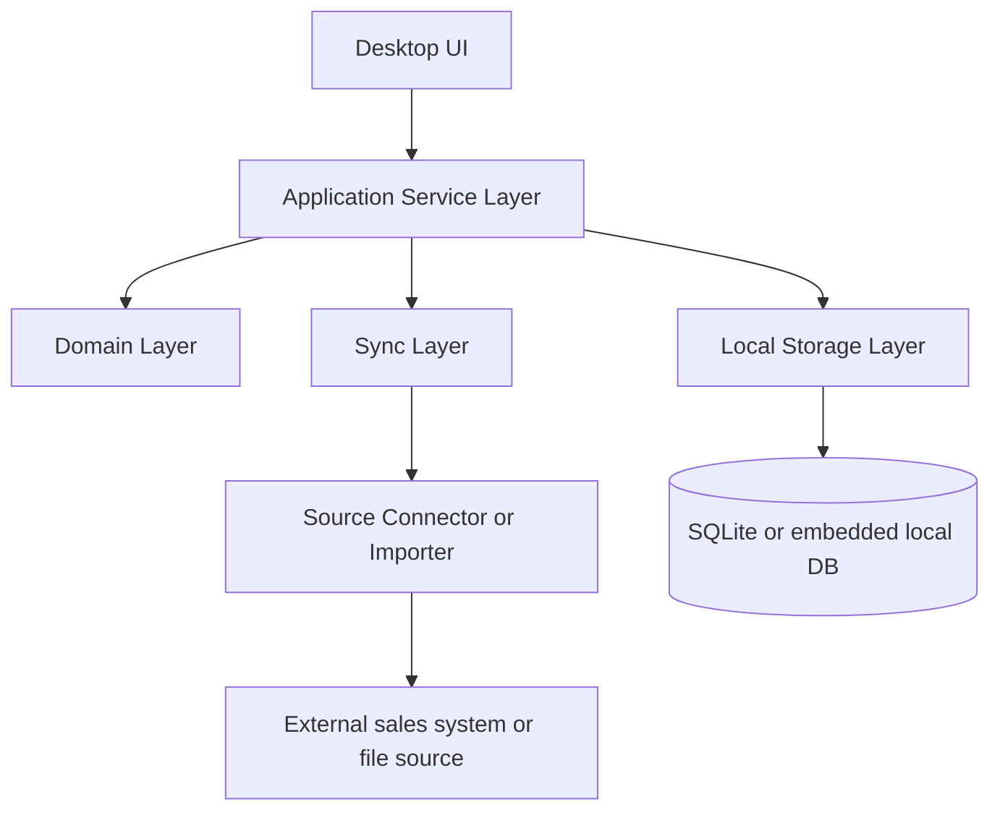

# Thiết kế ứng dụng desktop `VankhaDev - Quản Lý Khách Hàng`

## Mục tiêu sản phẩm

Xây dựng một ứng dụng desktop độc lập, chạy offline, giao diện tiếng Việt hiện đại, dễ dùng và ổn định để quản lý dữ liệu khách hàng nội bộ lâu dài, không phụ thuộc bắt buộc vào cloud.

Định hướng:

- **Local-first**: dữ liệu thao tác hàng ngày nằm trên máy người dùng.
- **Offline lâu dài**: không cần internet vẫn dùng đầy đủ CRUD, tìm kiếm, lọc, thống kê, nhập/xuất.
- **Sync tùy chọn**: chỉ đồng bộ khi có nguồn dữ liệu từ hệ thống bán hàng hiện tại hoặc khi người dùng chủ động kết nối.
- **Read-only lịch sử mua hàng**: thông tin mua hàng chỉ để hiển thị/tra cứu, không sửa trực tiếp trong app quản lý khách hàng.

---

## 1) Cấu trúc thư mục tối ưu cho app desktop

Khuyến nghị dùng mô hình desktop app tách lớp rõ ràng, ví dụ với Electron hoặc stack desktop tương đương:

```text
vankhadev-customer-manager/
├─ apps/
│  ├─ desktop/
│  │  ├─ src/
│  │  │  ├─ main/                # Main process desktop
│  │  │  ├─ preload/             # Bridge an toàn giữa main và renderer
│  │  │  ├─ renderer/            # UI desktop
│  │  │  │  ├─ pages/
│  │  │  │  ├─ components/
│  │  │  │  ├─ layouts/
│  │  │  │  ├─ hooks/
│  │  │  │  ├─ stores/
│  │  │  │  ├─ services/
│  │  │  │  ├─ utils/
│  │  │  │  └─ styles/
│  │  │  └─ shared/
│  │  │     ├─ types/
│  │  │     ├─ schemas/
│  │  │     ├─ constants/
│  │  │     └─ helpers/
│  │  ├─ public/
│  │  ├─ assets/
│  │  └─ tests/
│  └─ sync-agent/               # Tùy chọn: agent đồng bộ nguồn dữ liệu bán hàng
│     ├─ connectors/
│     ├─ importers/
│     └─ jobs/
├─ packages/
│  ├─ domain/                   # Business rules dùng chung
│  ├─ local-db/                 # Lớp lưu trữ local
│  ├─ sync-core/                # Đồng bộ, mapping, merge, conflict
│  ├─ licensing/                # Kích hoạt key, token, máy tính
│  ├─ import-export/            # CSV/XLSX/JSON backup/restore
│  └─ ui-kit/                   # Component dùng lại
├─ docs/
│  ├─ architecture/
│  ├─ data-model/
│  ├─ sync/
│  └─ licensing/
├─ resources/
├─ scripts/
└─ build/
```

### Gợi ý triển khai thực tế

- Nếu muốn dễ triển khai nhanh: vẫn có thể gói theo **Electron + React + SQLite**.
- Nếu muốn gọn nhẹ hơn: **Tauri + React + SQLite**.
- Dù chọn gì, nên giữ các lớp `domain`, `local-db`, `sync-core`, `licensing` tách riêng khỏi UI.

---

## 2) Kiến trúc tổng thể

### 2.1 Tổng quan các lớp



### 2.2 Vai trò từng lớp

#### Frontend desktop

- Giao diện tiếng Việt, điều hướng rõ ràng.
- Màn hình khách hàng, lịch sử mua hàng, thống kê, import/export, cài đặt.
- Chỉ gọi service qua lớp ứng dụng, không truy cập trực tiếp database từ UI.

#### Service layer

- Xử lý nghiệp vụ: CRUD khách hàng, chuẩn hóa dữ liệu, tìm kiếm, phân loại, trạng thái, thống kê.
- Orchestrate import/export, sync, validate dữ liệu, audit log.
- Chứa các use-case như `CreateCustomer`, `UpdateCustomer`, `MergeCustomer`, `ImportCustomers`.

#### Storage local

- Lưu khách hàng, lịch sử mua hàng cache, nhật ký thay đổi, cấu hình vận hành.
- Ưu tiên DB nhúng bền vững, dễ sao lưu, dễ migrate.

#### Sync layer

- Không bắt buộc để app chạy.
- Dùng khi có nguồn dữ liệu từ hệ thống bán hàng hiện tại.
- Hỗ trợ import ban đầu, đồng bộ định kỳ, đồng bộ thủ công, và mapping trường dữ liệu.


---

## 3) Luồng hoạt động chính

### 3.1 Luồng khởi động app

1. App khởi động.
2. Kiểm tra file cấu hình và DB local.
3. Tải dữ liệu cache cần thiết cho dashboard và danh sách khách hàng.
4. Vào dashboard chính.

### 3.2 Luồng CRUD khách hàng

#### Tạo mới

1. Người dùng mở màn hình thêm khách hàng.
2. UI nhập dữ liệu.
3. Service validate: tên bắt buộc, email hợp lệ, phone hợp lệ, trùng lặp gần đúng.
4. Chuẩn hóa dữ liệu.
5. Ghi DB local.
6. Ghi audit log.
7. Cập nhật danh sách và thống kê.

#### Cập nhật

1. Mở chi tiết khách hàng.
2. Chỉnh sửa dữ liệu.
3. Validate + chuẩn hóa.
4. Lưu local.
5. Ghi lịch sử thay đổi.

#### Xóa

- Khuyến nghị **xóa mềm**.
- Nếu khách đã có lịch sử mua hàng thì giữ liên kết, chỉ ẩn khỏi danh sách mặc định.

### 3.3 Luồng tìm kiếm, lọc, phân loại, trạng thái

- Tìm kiếm theo: tên, email, số điện thoại, mã khách, ghi chú, mã đơn/hóa đơn liên quan.
- Lọc theo: trạng thái, phân loại, nguồn dữ liệu, thời gian tạo, thời gian cập nhật, có/không có lịch sử mua hàng.
- Phân loại theo: khách mới, khách tiềm năng, khách thân thiết, khách VIP, khách ngưng tương tác, khách theo nhóm riêng.
- Trạng thái theo: active, inactive, archived, duplicate_candidate, blacklisted nếu cần.

### 3.4 Luồng nhập/xuất

- Import từ CSV/XLSX/JSON.
- Bản đồ cột trước khi nhập.
- Kiểm tra trùng.
- Xem trước số bản ghi sẽ thêm/cập nhật/bỏ qua.
- Xuất ra CSV/XLSX/JSON và backup nội bộ.

### 3.5 Luồng thống kê

- Tổng khách.
- Khách mới theo ngày/tháng.
- Khách theo phân loại.
- Tỷ lệ có email/sđt.
- Khách có lịch sử mua.
- Top khách theo giá trị mua, số đơn, lần mua gần nhất.

---

## 4) Các màn hình cần có

### 4.1 Dashboard

Mục đích:
- tóm tắt tổng quan dữ liệu
- hiển thị cảnh báo, số liệu nhanh, tác vụ gần đây

### 4.2 Danh sách khách hàng

Mục đích:
- xem, tìm kiếm, lọc, sắp xếp, chọn nhiều
- thao tác CRUD nhanh

### 4.3 Chi tiết khách hàng

Mục đích:
- xem toàn bộ hồ sơ
- xem lịch sử mua hàng read-only
- xem ghi chú, trạng thái, phân loại, timeline thay đổi

### 4.4 Thêm/Sửa khách hàng

Mục đích:
- nhập dữ liệu có validate rõ
- hỗ trợ tự điền, chọn từ danh mục, chuẩn hóa số điện thoại/email

### 4.5 Hợp nhất khách hàng trùng

Mục đích:
- gộp dữ liệu trùng tên/sđt/email
- chọn bản ghi gốc, chuyển lịch sử và ghi chú

### 4.6 Lịch sử mua hàng

Mục đích:
- xem đơn hàng, sản phẩm, số tiền, ngày mua, trạng thái
- chỉ đọc

### 4.7 Nhập dữ liệu

Mục đích:
- import từ file hoặc nguồn bán hàng
- mapping cột và preview

### 4.8 Xuất dữ liệu / Backup

Mục đích:
- xuất file để dùng ngoài app
- backup khôi phục an toàn

### 4.9 Đồng bộ từ nguồn bán hàng

Mục đích:
- nhận dữ liệu từ hệ thống bán hàng hiện tại
- map sang model khách hàng của app
- xem trạng thái sync và lỗi

### 4.10 Cài đặt

Mục đích:
- cấu hình đường dẫn backup
- chế độ tự lưu
- ngôn ngữ
- giao diện
- nhật ký và bảo mật

---

## 5) Mô hình dữ liệu khách hàng đầy đủ

### 5.1 Thực thể chính: Customer

Các nhóm trường nên có:

#### Nhận diện
- `id`
- `customer_code`
- `full_name`
- `display_name`
- `alias`
- `normalized_name`

#### Liên hệ
- `email`
- `phone`
- `secondary_phone`
- `zalo`
- `facebook`
- `address`
- `province`
- `district`
- `ward`

#### Phân loại và trạng thái
- `customer_type_id`
- `customer_type_name`
- `segment`
- `status`
- `source`
- `priority_level`
- `tags`

#### Doanh nghiệp nếu có
- `company_name`
- `tax_code`
- `company_address`
- `contact_person`

#### Ghi chú và chăm sóc
- `note`
- `care_note`
- `last_contacted_at`
- `next_followup_at`
- `assigned_user_id`

#### Theo dõi hệ thống
- `created_at`
- `updated_at`
- `deleted_at`
- `created_by`
- `updated_by`
- `version`
- `sync_state`
- `external_refs`

### 5.2 Lịch sử mua hàng read-only

Nên tách thành các bảng cache/readonly:

- `customer_purchases`
- `purchase_orders`
- `purchase_order_items`
- `purchase_payments`
- `purchase_events`

Trường tối thiểu:
- `external_order_id`
- `order_code`
- `order_date`
- `product_name`
- `sku`
- `quantity`
- `unit_price`
- `total_amount`
- `payment_status`
- `source_system`
- `synced_at`

### 5.3 Bảng quan hệ phụ

- `customer_tags`
- `customer_notes`
- `customer_activity_logs`
- `customer_merge_map`
- `customer_source_map`
- `customer_attachments` nếu cần

### 5.4 Gợi ý chuẩn hóa

- Email lower-case.
- Phone chuẩn hóa dạng digits + mã quốc gia nếu cần.
- Tên rút gọn cho tìm kiếm không dấu.
- Lưu thêm trường `search_text` để tối ưu tra cứu offline.

---

## 6) Cơ chế lưu trữ offline an toàn, dùng lâu dài

### Đề xuất chính

- **SQLite** làm storage cốt lõi.
- File DB lưu trong thư mục dữ liệu người dùng của app.
- Dùng migration versioned để nâng cấp lâu dài.
- Có backup/restore nội bộ.

### Lý do

- Ổn định, dễ deploy, không cần service DB riêng.
- Dễ sao lưu, dễ kiểm tra, phù hợp desktop độc lập.
- Có thể mã hóa file hoặc từng trường nhạy cảm nếu cần.

### An toàn dữ liệu

- Encrypt file hoặc encryption-at-rest cho dữ liệu nhạy cảm.
- Có checksum/backup manifest.
- Ghi journal/audit log.
- Chặn ghi trực tiếp từ UI, chỉ qua service layer.
- Auto-backup theo lịch cục bộ.

### Chiến lược dài hạn

- Mỗi lần nâng cấp schema phải có migration.
- Có tool kiểm tra integrity.
- Backup định kỳ theo phiên bản trước khi migrate.

---

## 7) Quy trình nhập/xuất dữ liệu an toàn, dễ dùng

### 7.1 Nhập dữ liệu

#### Nguồn hỗ trợ
- CSV
- XLSX
- JSON
- gói backup nội bộ
- đồng bộ từ hệ thống bán hàng hiện tại

#### Quy trình
1. Chọn file.
2. Phân tích cấu trúc.
3. Map cột.
4. Xem preview.
5. Kiểm tra trùng theo `phone/email/customer_code/external_id`.
6. Chọn chính sách nhập:
   - thêm mới
   - cập nhật nếu trùng
   - bỏ qua nếu trùng
   - hợp nhất
7. Xác nhận.
8. Ghi DB + log.

### 7.2 Xuất dữ liệu

#### Tùy chọn
- xuất danh sách lọc hiện tại
- xuất toàn bộ
- xuất chỉ khách có mua hàng
- xuất backup đầy đủ gồm metadata và lịch sử

#### Yêu cầu an toàn
- đặt mật khẩu cho file backup nếu cần
- hiển thị rõ dung lượng và nội dung sẽ xuất
- có xác nhận trước khi export
- cho phép mã hóa file xuất

### 7.3 Backup / restore

- Backup dạng package riêng của app.
- Gồm DB, manifest, version, hash.
- Restore phải kiểm tra version và integrity.

---

## 8) Vận hành ứng dụng ở môi trường offline-first

### 8.1 Mô hình tổng quát

- Ứng dụng ưu tiên chạy cục bộ với dữ liệu lưu trên máy.
- Khi có nguồn dữ liệu ngoài, đồng bộ là tùy chọn chứ không phải điều kiện bắt buộc.
- Trạng thái người dùng và cấu hình vận hành được lưu local để app khởi động ổn định.

### 8.2 Luồng vận hành đề xuất

1. Người dùng mở ứng dụng.
2. App nạp cấu hình và dữ liệu local.
3. Nếu có nguồn ngoài phù hợp:
   - cho phép đồng bộ hoặc import thủ công.
4. Lưu thay đổi vào storage local an toàn.
5. Mở toàn bộ chức năng nghiệp vụ cần thiết.

### 8.3 Lưu trạng thái trên máy

Nên lưu ở hai lớp:

- dữ liệu nghiệp vụ trong SQLite
- cấu hình/manifest vận hành trong thư mục app data

Trường tối thiểu:
- `user_id`
- `last_opened_at`
- `status`
- `device_id`
- `last_synced_at`

### 8.4 Hành vi khi khởi động offline

- Cho phép mở app và xem giới hạn.
- Chỉ cho dùng một số màn hình tối thiểu, ví dụ:
  - xem giới thiệu
  - nhập key
  - xem trạng thái máy
- Không cho CRUD đầy đủ nếu policy yêu cầu khóa.
- Hiển thị rõ ràng lý do khóa và cách kích hoạt.

### 8.5 Cách kiểm tra key thực tế

Đề xuất ưu tiên:

- Key format check local.
- Xác minh chữ ký số của token kích hoạt.
- Device binding bằng fingerprint ổn định vừa phải.
- Cho phép offline re-check bằng token local.

Không nên phụ thuộc vào API online bắt buộc để mở app, vì ràng buộc phải dùng lâu dài không cần internet.

---

## 9) Phương án đồng bộ dữ liệu khách hàng từ hệ thống bán hàng hiện tại

### 9.1 Nguyên tắc

- Đồng bộ là **tùy chọn**.
- App phải hoạt động độc lập ngay cả khi không có nguồn đồng bộ.
- Dữ liệu từ hệ thống bán hàng hiện tại chủ yếu là **nguồn tham chiếu** để làm giàu hồ sơ khách hàng.

### 9.2 Các kiểu đồng bộ nên hỗ trợ

#### Giai đoạn 1
- Import file định kỳ từ hệ thống bán hàng hiện tại.
- Map trường thủ công hoặc bán tự động.
- Lưu `external_id` để đối chiếu.

#### Giai đoạn 2
- Kết nối connector tới source hiện có.
- Pull dữ liệu khách hàng, đơn hàng, lịch sử mua.
- Tăng dần khả năng incremental sync.

### 9.3 Cách map dữ liệu

Khuyến nghị map theo độ tin cậy:

1. `external_customer_id`
2. `phone`
3. `email`
4. `customer_code`
5. `name + ngày tạo gần đúng` nếu thiếu định danh

### 9.4 Quy tắc merge

- Không ghi đè dữ liệu local quan trọng nếu source không chắc chắn hơn.
- Trường từ nguồn bán hàng chỉ cập nhật các trường được đánh dấu syncable.
- Nếu có xung đột:
  - giữ cả hai phiên bản
  - đánh dấu cần review

### 9.5 Lịch sử mua hàng

- Đồng bộ read-only.
- Không chỉnh sửa đơn gốc.
- Chỉ cache thông tin cần thiết để hiển thị đủ cho nhân viên quản lý khách hàng.

### 9.6 Có thể dùng nguồn nào

Tùy hệ thống hiện tại, connector có thể là:
- xuất file từ hệ thống bán hàng
- database read-only bridge
- API nội bộ
- bundle sync agent chạy cùng máy nội bộ

Ưu tiên thực tế: **file import + connector nội bộ** trước, rồi mới mở rộng.

---

## 10) MVP và giai đoạn 2

### MVP

- Đăng nhập nội bộ hoặc mở app sau khi kích hoạt.
- DB local SQLite.
- Danh sách khách hàng.
- CRUD khách hàng.
- Tìm kiếm/lọc/phân loại/trạng thái.
- Chi tiết khách hàng với lịch sử mua read-only cache.
- Import/export CSV/XLSX.
- Backup/restore.
- Audit log cơ bản.

### Giai đoạn 2

- Hợp nhất khách trùng nâng cao.
- Đồng bộ gia tăng từ nguồn bán hàng hiện tại.
- Đồng bộ lịch sử mua hàng đầy đủ hơn.
- Phân quyền nhiều vai trò.
- Mã hóa dữ liệu nhạy cảm.
- Báo cáo nâng cao và dashboard tùy biến.
- Plugin connector cho nhiều nguồn dữ liệu.

---

## 11) Khuyến nghị kỹ thuật triển khai thực tế

### Stack khuyến nghị

- **Desktop shell**: Electron hoặc Tauri.
- **UI**: React + TypeScript.
- **Local DB**: SQLite.
- **Migrations**: versioned migrations.
- **Export/import**: CSV/XLSX/JSON.
- **Validation**: schema-based validation.
- **Sync**: connector/service tách rời.

### Lý do chọn phương án này

- Dễ triển khai trong môi trường desktop độc lập.
- Không phụ thuộc cloud bắt buộc.
- Dễ bảo trì và mở rộng.
- Phù hợp quản lý dữ liệu nội bộ lâu dài.

---

## 12) Kết luận kiến trúc

Phương án phù hợp nhất cho bài toán này là một ứng dụng desktop **local-first** với **SQLite**, UI tiếng Việt, service layer rõ ràng, import/export an toàn, và đồng bộ tùy chọn từ nguồn bán hàng hiện tại.

Điểm quan trọng nhất:

- **Local-first** cho mọi thao tác hàng ngày.
- **Sync tùy chọn** chỉ khi có source.
- **Read-only** cho lịch sử mua hàng.
- **Không phụ thuộc internet** để sử dụng lâu dài.
- **Tách lớp rõ ràng** để dễ bảo trì và mở rộng.
